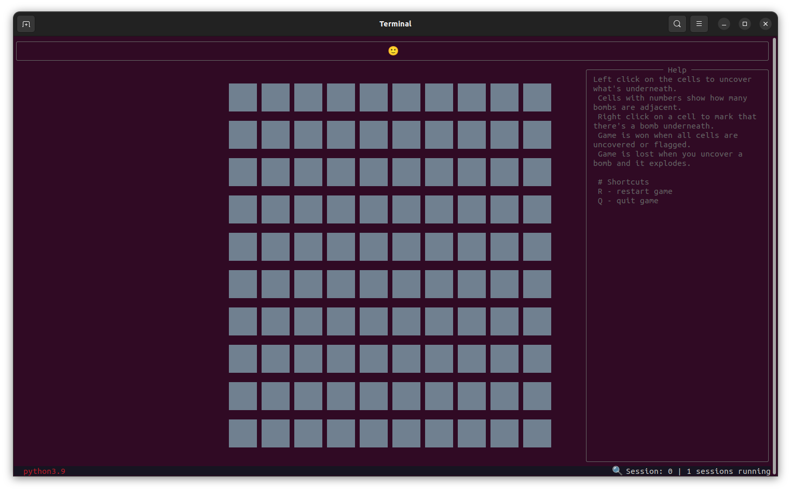
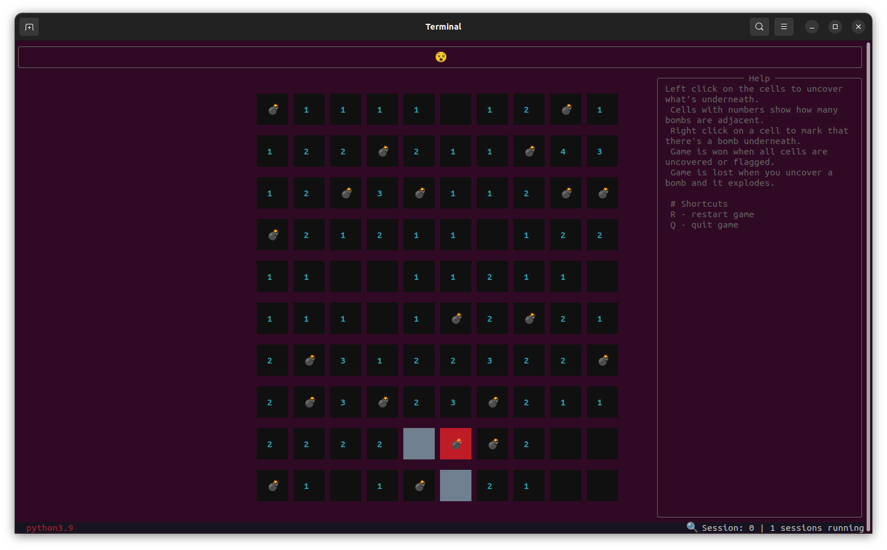
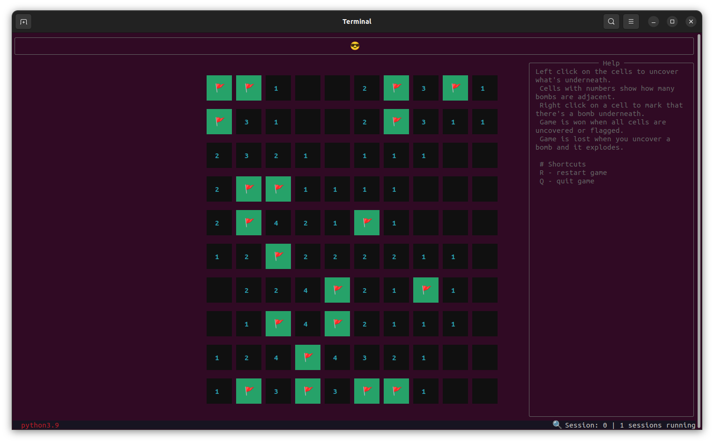

# Swept

A [minesweeper](https://en.wikipedia.org/wiki/Minesweeper\_\(video_game\)) clone for the terminal. built with [Textual](https://github.com/Textualize/textual).

The main purpose of this project was to learn Textual and TUIs.

## Prerequisites

- Python 3.9+
- [Python Poetry](https://python-poetry.org/)

## Installation

- Git clone this repository
- From the root folder install with `poetry install`.

## Usage

- Run with `poetry run python swept/main.py`
- The game contains a help panel with instructions on how to play.

## Screenshots

### Game Lost

### Game won

